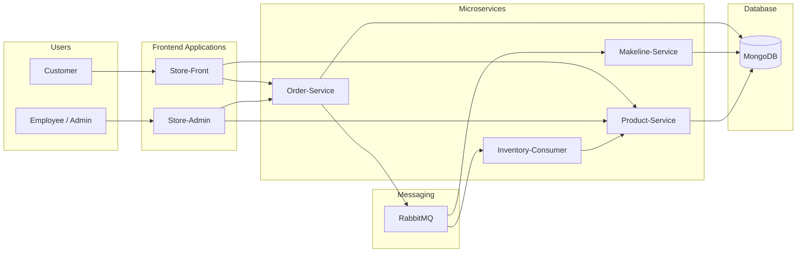

# bestbuy-cloud-native-app


## Architecture Diagram


```

## bestbuy-store-front
https://github.com/Jingjing-Duan/bestbuy-store-front

## bestbuy-store-admin
https://github.com/Jingjing-Duan/bestbuy-store-admin


## bestbuy-product-service
https://github.com/Jingjing-Duan/bestbuy-product-service


## bestbuy-inventory-consumer
https://github.com/Jingjing-Duan/bestbuy-inventory-consumer


## bestbuy-order-service
https://github.com/Jingjing-Duan/bestbuy-order-service


## bestbuy-makeline-service
https://github.com/Jingjing-Duan/bestbuy-makeline-service


## bestbuy-cloud-deployment
https://github.com/Jingjing-Duan/bestbuy-cloud-deployment


