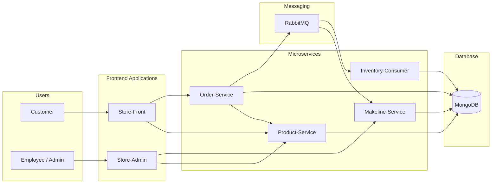

# Best Buy Cloud-Native Application

## Demo Video

## Averview  

This project is a cloud-native microservices application deployed on Azure Kubernetes Service (AKS).  

The system simulates an e-commerce platform where customers can browse products, place orders, and administrators can monitor order processing.  

The application follows a microservices architecture and uses asynchronous messaging for decoupled order processing.  

## Architecture Diagram

## Application Explanation  
🔹 Store-Front  

Customer-facing web application used to browse products and place orders.  

<<<<<<< HEAD
🔹 Store-Admin  

Admin web application used to monitor order processing results (Makeline).  

🔹 Product-Service  

Manages product data, including product details and stock.  

🔹 Order-Service  

Handles order creation and publishes messages to RabbitMQ.  

🔹 Makeline-Service  

Background worker that processes orders asynchronously and updates order status.  

🔹 Inventory-Consumer  

Consumes messages from RabbitMQ and updates product stock in MongoDB.  

🔹 RabbitMQ  

Message broker used for asynchronous communication between services.  

🔹 MongoDB  

Database used to store product and order-related data.  

## Deployment Instructions

1. Build and Push Docker Images  

For each service:  

docker build -t <your-docker-username>/<service-name>:latest .  
docker push <your-docker-username>/<service-name>:latest  

2. Deploy to Kubernetes (AKS)  

Apply all Kubernetes manifests:  

kubectl apply -f Deployment Files/  

3. Verify Deployment  

kubectl get pods  
kubectl get svc  

4. Access Applications  
Store-Front → External IP from LoadBalancer  
Store-Admin → External IP from LoadBalancer  

5. Test the Application  

Open Store-Front  
Place an order  
Open Store-Admin  
Verify order processing status  

## Links Table
| Service            | GitHub Repository                                                                                                          | Docker Image                                                                                                           |
| ------------------ | -------------------------------------------------------------------------------------------------------------------------- | ---------------------------------------------------------------------------------------------------------------------- |
| Store-Front        | [https://github.com/Jingjing-Duan/bestbuy-store-front](https://github.com/Jingjing-Duan/bestbuy-store-front)               | [https://hub.docker.com/r/duan0029/store-front](https://hub.docker.com/r/duan0029/store-front)               |
| Store-Admin        | [https://github.com/Jingjing-Duan/bestbuy-store-admin](https://github.com/Jingjing-Duan/bestbuy-store-admin)               | [https://hub.docker.com/r/duan0029/store-admin](https://hub.docker.com/r/duan0029/store-admin)               |
| Product-Service    | [https://github.com/Jingjing-Duan/bestbuy-product-service](https://github.com/Jingjing-Duan/bestbuy-product-service)       | [https://hub.docker.com/r/duan0029/product-service](https://hub.docker.com/r/duan0029/product-service)       |
| Order-Service      | [https://github.com/Jingjing-Duan/bestbuy-order-service](https://github.com/Jingjing-Duan/bestbuy-order-service)           | [https://hub.docker.com/r/duan0029/order-service](https://hub.docker.com/r/duan0029/order-service)           |
| Makeline-Service   | [https://github.com/Jingjing-Duan/bestbuy-makeline-service](https://github.com/Jingjing-Duan/bestbuy-makeline-service)     | [https://hub.docker.com/r/duan0029/makeline-service](https://hub.docker.com/r/duan0029/makeline-service)     |
| Inventory-Consumer | [https://github.com/Jingjing-Duan/bestbuy-inventory-consumer](https://github.com/Jingjing-Duan/bestbuy-inventory-consumer) | [https://hub.docker.com/r/duan0029/inventory-consumer](https://hub.docker.com/r/duan0029/inventory-consumer) |
=======

